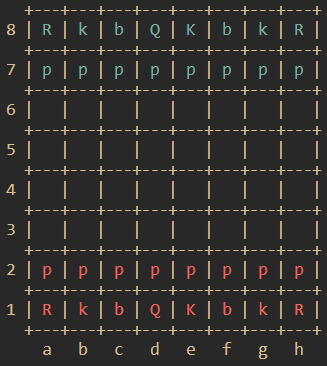
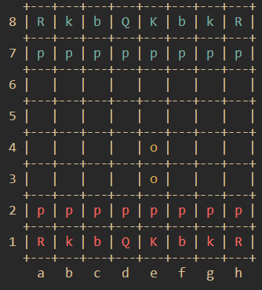

# light-chess
A light chess is an hobby chess backend made in C++

    
    

## TODO:

- [ ] `undo` function
- [ ] Terminal user interface
- [ ] `is_check` function
- [ ] Game and board serialization (load and save)